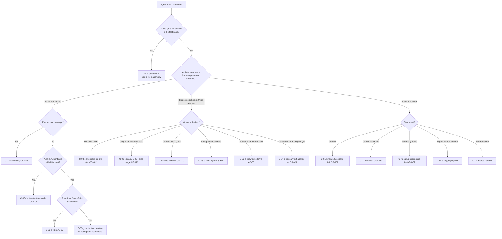
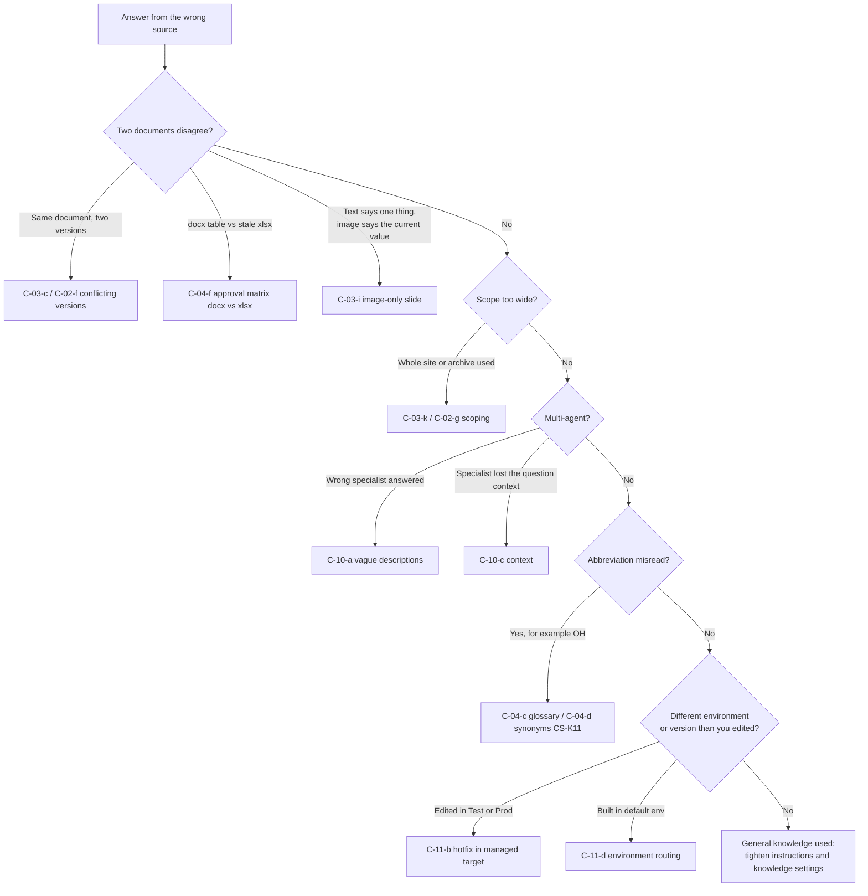
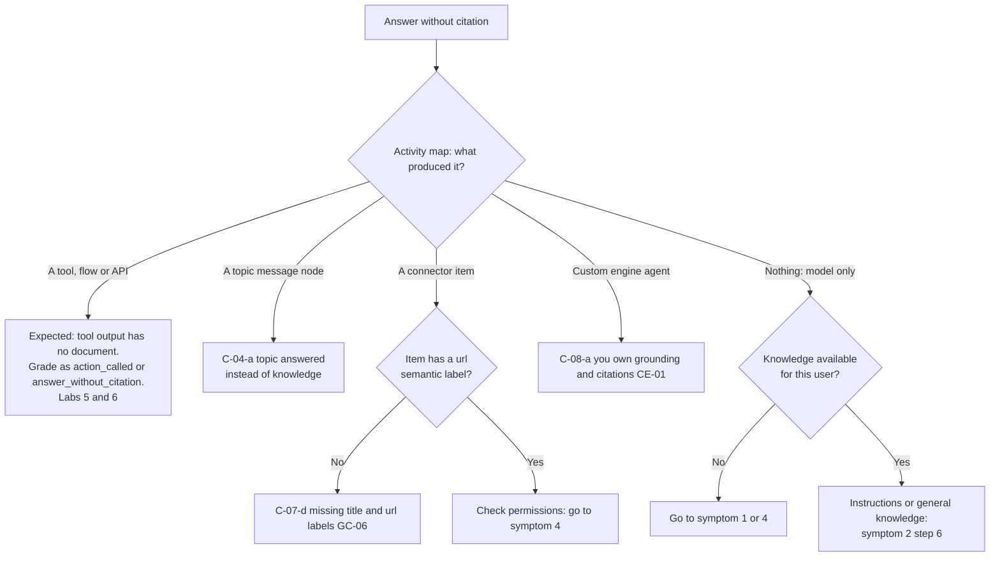
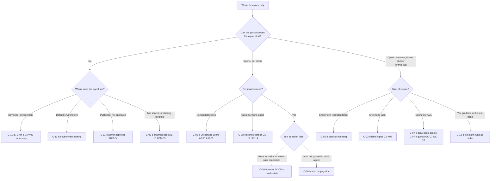

# Troubleshooting decision tree

Use this page when an eval row fails, or when a user reports a problem with a Harbourline agent. Pick the symptom, answer the questions in order, and stop at the first leaf that matches. Every leaf names the caveat and links to the break-it section of the lab that reproduces it, so you can confirm the cause by reproducing it and then apply the documented fix.

Four symptoms:

1. [The agent does not answer](#1-the-agent-does-not-answer)
2. [The agent answers from the wrong source](#2-the-agent-answers-from-the-wrong-source)
3. [The agent answers without a citation](#3-the-agent-answers-without-a-citation)
4. [It works for the maker only](#4-it-works-for-the-maker-only)

Before you start, collect three facts:

- **Who** asked (persona) and **where** (test pane, Teams, Microsoft 365 Copilot, Agent Builder).
- **What the orchestrator did**: for Copilot Studio agents, the activity map of that turn (knowledge source, topic, tool, or nothing). For Agent Builder and declarative agents, the references shown under the answer.
- **Whether the maker gets the right answer** for the same prompt in the test pane. If yes and the persona does not, go straight to symptom 4.

Links use lab folder paths. Section anchors are given where the break-it section exists; if an anchor does not resolve in your copy, open the file and find the caveat ID.

---

## 1. The agent does not answer

"I couldn't find that", a generic fallback, an error message, or nothing.

### Text version

1. **Does the maker get the answer in the test pane?** Yes: it is a permission or reach problem, go to [symptom 4](#4-it-works-for-the-maker-only). No: continue.
2. **Nothing was searched and no tool ran.**
   - The reply is a rate or capacity message, or many evaluation cases fail with errors at once: throttling. Leaf: **C-12-a**, generative AI message rate (CS-A01). [Lab 12 break-it](../lab-12-eval-troubleshooting/break-it.md#c-12-a-bulk-evaluation-throttled-in-a-developer-environment)
   - The agent's authentication is not "Authenticate with Microsoft": SharePoint knowledge and tenant graph grounding are unavailable. Leaf: **C-03-f** (CS-K04). [Lab 3 break-it](../lab-03-studio-sharepoint-knowledge/break-it.md#c-03-f-authentication-mode)
   - Restricted SharePoint Search is on: SharePoint knowledge is unavailable in Agent Builder. Leaf: **C-02-e** (AB-07). [Lab 2 break-it](../lab-02-agent-builder-deep-dive/break-it.md#c-02-e-restricted-sharepoint-search-discussion-only)
   - The question was blocked or ignored as out of scope: content moderation or instructions too strict. Leaf: **C-03-g**. [Lab 3 break-it](../lab-03-studio-sharepoint-knowledge/break-it.md#c-03-g-content-moderation-too-strict)
3. **A knowledge source was searched but returned nothing.** Where does the fact live (use `data/answer-keys/*.md`)?
   - In a file larger than 7 MB, with tenant graph grounding off (for example the 25-year service award in the 9.1 MB handbook, L12-Q06). Leaf: **C-03-a** (CS-K01, CS-K02). [Lab 3 break-it](../lab-03-studio-sharepoint-knowledge/break-it.md#c-03-a-oversized-file-silently-excluded)
   - Only in an image: a scanned PDF (ACK-2025-0457, L12-Q07) or a picture on a slide. Leaves: **C-03-b** and **C-03-i** (CS-K13, UNVERIFIED). [Lab 3 break-it, scan](../lab-03-studio-sharepoint-knowledge/break-it.md#c-03-b-scanned-image-only-pdf), [slide image](../lab-03-studio-sharepoint-knowledge/break-it.md#c-03-i-image-only-slide-content)
   - In a SharePoint list row after row 2,048 (for example Northgate, row 2,501) in a Copilot Studio agent. Leaf: **C-03-h** (CS-K10). [Lab 3 break-it](../lab-03-studio-sharepoint-knowledge/break-it.md#c-03-h-sharepoint-list-2048-row-window)
   - In a file with an encrypting sensitivity label, or in a file uploaded to the agent that is encrypted. Leaf: **C-03-e** (CS-K08, CS-K09). [Lab 3 break-it](../lab-03-studio-sharepoint-knowledge/break-it.md#c-03-e-encrypting-sensitivity-label)
   - In a source the agent could not add because a count limit was reached (Agent Builder: files, lists, uploaded files, URLs). Leaf: **C-02-a** (AB-04, AB-05). [Lab 2 break-it](../lab-02-agent-builder-deep-dive/break-it.md#c-02-a-knowledge-source-limits)
   - In a Dataverse table, and the question uses an abbreviation or synonym added less than 15 minutes ago. Leaf: **C-04-c** glossary not applied yet (CS-K11). [Lab 4 break-it](../lab-04-studio-dataverse-topics/break-it.md#c-04-c-glossary-not-applied-yet)
   - In a spreadsheet with merged header cells, and the agent cannot find the row. Leaf: **C-03-j**. [Lab 3 break-it](../lab-03-studio-sharepoint-knowledge/break-it.md#c-03-j-merged-cell-spreadsheet)
4. **A tool, flow or connected agent ran.** What did it return?
   - It timed out: agent flows must respond within 100 seconds (CS-A02). Leaf: **C-05-b**. [Lab 5 break-it](../lab-05-studio-actions-flows/break-it.md#c-05-b-agent-flow-100-second-response-limit)
   - It could not reach the API: the dev tunnel is down, or the environment variable `hle_OutageApiBaseUrl` in that environment points somewhere else. Leaf: **C-11-f**. [Lab 11 break-it](../lab-11-alm-governance/break-it.md#c-11-f-environment-specific-values-travel-with-the-solution)
   - It returned more than Copilot can use (25 items, 4,096 tokens, 45 seconds for plugins, DA-07), or the OpenAPI description breaks a documented rule (DA-12). Leaves: **C-06-c** and **C-06-b**. [Lab 6 break-it, response limits](../lab-06-declarative-agents-toolkit/break-it.md#c-06-c-plugin-response-limits-items-tokens-timeout), [OpenAPI constraints](../lab-06-declarative-agents-toolkit/break-it.md#c-06-b-openapi-constraints-broken-spec)
   - An autonomous run started from a trigger that carried only file metadata. Leaf: **C-09-a**. [Lab 9 break-it](../lab-09-autonomous-triggers/break-it.md#c-09-a-trigger-payload-carries-metadata-not-content)
   - A parent agent handed off and the child or connected agent failed. Leaf: **C-10-d**. [Lab 10 break-it](../lab-10-multi-agent/break-it.md#c-10-d-debugging-a-failed-handoff)
   - The API returned an error such as 400 `CREW_OFF_SHIFT` or 409 `OUTAGE_ALREADY_RESTORED` (L12-Q09, L12-Q10): the agent is right not to report success. This is a pass if the agent explains the error.

---

## 2. The agent answers from the wrong source

The answer is fluent but uses an old, stale, out-of-scope or wrong document, or the wrong specialist agent.

### Text version

1. **Two sources disagree.**
   - Two versions of the same policy (Leave Policy HR-POL-012: v3.0 says 10 carry-over days, v4.0 says 5; L12-Q03). Leaves: **C-03-c** and **C-02-f**. [Lab 3 break-it](../lab-03-studio-sharepoint-knowledge/break-it.md#c-03-c-conflicting-leave-policy-versions), [Lab 2 break-it](../lab-02-agent-builder-deep-dive/break-it.md#c-02-f-conflicting-leave-policy-versions)
   - A document and a stale working copy (Approval Matrix: docx Director limit for consulting 75,000, xlsx still 150,000; L12-Q04). Leaf: **C-04-f**; the fix pattern is the same as **C-03-c** (prefer the newest effective version, flag conflicts, archive the stale copy). [Lab 4 break-it](../lab-04-studio-dataverse-topics/break-it.md#c-04-f-approval-matrix-docx-vs-xlsx)
   - The text says one thing and an image carries the current value (this season's staging area is Napanee Fairgrounds, only in slide 4 of the crew briefing deck; the playbook text says Kingston Service Centre). Leaf: **C-03-i**. [Lab 3 break-it](../lab-03-studio-sharepoint-knowledge/break-it.md#c-03-i-image-only-slide-content)
2. **Scope is too wide.** A whole-site source pulls in archive or unrelated libraries. Leaves: **C-03-k** and **C-02-g**. [Lab 3 break-it](../lab-03-studio-sharepoint-knowledge/break-it.md#c-03-k-whole-site-vs-library-scoping), [Lab 2 break-it](../lab-02-agent-builder-deep-dive/break-it.md#c-02-g-whole-site-vs-specific-library-scoping)
3. **Multi-agent routing.**
   - The parent sent the question to the wrong specialist (L12-Q15 should go to HLE Policy Router). Leaf: **C-10-a**. [Lab 10 break-it](../lab-10-multi-agent/break-it.md#c-10-a-vague-descriptions-misroute-questions)
   - The specialist answered a different question because context did not carry across the handoff. Leaf: **C-10-c**. [Lab 10 break-it](../lab-10-multi-agent/break-it.md#c-10-c-conversation-context-across-the-handoff)
4. **An abbreviation was misread.** "OH" in a work order title means overhead, not Ohio (WO-2026-01076, L12-Q11). Leaves: **C-04-c** (CS-K11: up to 15 minutes to apply) and **C-04-d** synonym collision. [Lab 4 break-it, glossary](../lab-04-studio-dataverse-topics/break-it.md#c-04-c-glossary-not-applied-yet), [synonyms](../lab-04-studio-dataverse-topics/break-it.md#c-04-d-synonym-collision)
5. **You are not testing what you think.**
   - The component was edited in `HLE-Test` or `HLE-Prod`, so an unmanaged layer hides the deployed version. Leaf: **C-11-b**. [Lab 11 break-it](../lab-11-alm-governance/break-it.md#c-11-b-hotfix-edited-in-the-managed-target)
   - The agent was built in the default environment, not the governed one. Leaf: **C-11-d**. [Lab 11 break-it](../lab-11-alm-governance/break-it.md#c-11-d-makers-land-in-the-default-environment)
   - Connector content is out of date or a schema change did not apply. Leaves: **C-07-c** indexing latency and **C-07-a** schema changes (GC-04). [Lab 7 break-it, latency](../lab-07-copilot-connector/break-it.md#c-07-c-indexing-latency-after-ingestion), [schema](../lab-07-copilot-connector/break-it.md#c-07-a-schema-changes-are-constrained-after-registration)
6. **None of the above:** the model used general knowledge. In Copilot Studio, turn off general knowledge and keep the instruction "Do not guess and do not use general knowledge" (Lab 3 README). In Agent Builder, "Only use specified sources" reduces but does not fully block general knowledge (Lab 2 README, Part B step 6).

---

## 3. The agent answers without a citation

The facts may be right, but no reference to a document is shown.

### Text version

1. **A tool, flow or API produced it** (outage status, dispatch, customer lookup). No document exists to cite, so this is expected. The eval row should say `action_called` or `answer_without_citation`. If the reply should name the system of record, add that to the instructions or the adaptive card. Background: [Lab 5 README](../lab-05-studio-actions-flows/README.md), [Lab 6 README](../lab-06-declarative-agents-toolkit/README.md).
2. **A topic produced it.** A message node in a classic topic returns static text with no citation. Either move that content into knowledge or accept it as a scripted answer. Leaf: **C-04-a** topic hijacks a knowledge question. [Lab 4 break-it](../lab-04-studio-dataverse-topics/break-it.md#c-04-a-topic-hijacks-a-knowledge-question)
3. **A connector item produced it**, but there is no link. Connector items need a retrievable property with the `url` semantic label (and `title`) for Copilot to show a proper reference (GC-05, GC-06). Leaf: **C-07-d**. [Lab 7 break-it](../lab-07-copilot-connector/break-it.md#c-07-d-missing-title-and-url-semantic-labels)
4. **A custom engine agent produced it.** A custom engine agent owns its orchestration and model (CE-01), so citations appear only if your code returns them. Leaf: **C-08-a**. [Lab 8 break-it](../lab-08-custom-engine-agent/break-it.md#c-08-a-no-copilot-orchestrator-you-own-grounding)
5. **Nothing was searched: the model answered alone.**
   - If the user cannot reach the knowledge (license, permission, authentication), go to [symptom 4](#4-it-works-for-the-maker-only) or [symptom 1](#1-the-agent-does-not-answer).
   - Otherwise the agent is allowed to answer from general knowledge: see [symptom 2](#2-the-agent-answers-from-the-wrong-source), step 6.

---

## 4. It works for the maker only

The maker (learner) gets the right answer in the test pane or in Teams; a persona gets nothing, an error, or a different answer. Also use this branch in reverse: a persona sees something the maker cannot (ticket 104321, L12-Q12 and L12-Q13).

### Text version

1. **The persona cannot open or find the agent.**
   - The agent lives in a developer environment, which is owner-only and cannot be shared with security groups (ENV-02). Leaves: **C-11-g** and **C-04-g**. [Lab 11 break-it](../lab-11-alm-governance/break-it.md#c-11-g-personas-cannot-reach-an-agent-in-the-developer-environment), [Lab 4 break-it](../lab-04-studio-dataverse-topics/break-it.md#c-04-g-developer-environment-is-owner-only)
   - It was built in the default environment by accident. Leaf: **C-11-d**. [Lab 11 break-it](../lab-11-alm-governance/break-it.md#c-11-d-makers-land-in-the-default-environment)
   - It was published to the organization but is still waiting for an admin, or an update is pending and users still get the old version (ADM-04, AB-10). Leaf: **C-11-e**. [Lab 11 break-it](../lab-11-alm-governance/break-it.md#c-11-e-published-agent-waits-for-admin-approval)
   - It was never shared with that persona, groups were added as editors, or org-wide sharing is off (AB-10, ADM-03), or the Microsoft 365 **User access** setting excludes the persona (ADM-02). Leaf: **C-02-c**. [Lab 2 break-it](../lab-02-agent-builder-deep-dive/break-it.md#c-02-c-sharing-scope)
2. **The persona opens it but gets an error.**
   - The persona has no Microsoft 365 Copilot license (Tom Whitfield, L12-Q14). Users need the licenses the agent's capabilities require (AB-11, LIC-05). Leaf: **C-02-d**. [Lab 2 break-it](../lab-02-agent-builder-deep-dive/break-it.md#c-02-d-unlicensed-users)
   - It is a custom engine agent: the docs conflict on whether a Copilot license is needed (LIC-13, LIC-14). Leaf: **C-08-c**. [Lab 8 break-it](../lab-08-custom-engine-agent/break-it.md#c-08-c-license-requirement-conflict)
   - A tool fails for the persona: the tool uses a connection the persona does not have, or it runs with the maker's credentials (event triggers always do, CS-A08). Leaves: **C-09-b** and **C-05-a** (also **C-05-d** if a data policy blocks the connector). [Lab 9 break-it](../lab-09-autonomous-triggers/break-it.md#c-09-b-run-as-identity), [Lab 5 break-it](../lab-05-studio-actions-flows/break-it.md#c-05-a-maker-credentials-vs-end-user-credentials), [DLP](../lab-05-studio-actions-flows/break-it.md#c-05-d-data-policy-dlp-blocks-the-custom-connector)
   - In a multi-agent setup the user's authentication is not passed to the specialist. Leaf: **C-10-b**. [Lab 10 break-it](../lab-10-multi-agent/break-it.md#c-10-b-authentication-propagation)
3. **The persona gets answers, but not this fact.** This is usually correct behavior; confirm the persona is not meant to see it (`data/answer-keys/*.md`, persona tables).
   - The file is in a folder with broken inheritance (`HR-Policies/Restricted`, HR only). Leaf: **C-03-d**. [Lab 3 break-it](../lab-03-studio-sharepoint-knowledge/break-it.md#c-03-d-security-trimming-per-persona)
   - The file has an encrypting label that grants EXTRACT to the HR group only (Compensation Bands, L12-Q01 and L12-Q02, CS-K08). Leaf: **C-03-e**. [Lab 3 break-it](../lab-03-studio-sharepoint-knowledge/break-it.md#c-03-e-encrypting-sensitivity-label)
   - The item comes from the `HLE Tickets` connector and its ACL grants a group the persona is not in, or denies a group the persona is in (deny wins, GC-07); guest behavior is UNVERIFIED (GC-10). Leaves: **C-07-b** and **C-07-e**. [Lab 7 break-it, deny](../lab-07-copilot-connector/break-it.md#c-07-b-acl-deny-beats-grant), [guests](../lab-07-copilot-connector/break-it.md#c-07-e-items-not-appearing-for-guests)
4. **You graded a persona row in the test pane.** The test pane, and evaluation runs by default, use the maker's identity, and the learner is in every course group. Leaf: **C-12-c**. [Lab 12 break-it](../lab-12-eval-troubleshooting/break-it.md#c-12-c-test-pane-and-evaluation-run-as-the-maker)

---

## After the fix

1. Re-run the failed row as the original persona, in the original channel.
2. Record the new result with `-Redo`, and write the leaf and caveat ID in the notes.
3. If the fix changed the agent, re-run the other rows for that agent (or its evaluation test set) to check for regressions.
4. If the cause is a documented limit you cannot change (for example CS-K10), record the row as `fail` with the limit ID, and propose a design change (for example Agent Builder list knowledge, AB-06, or a Dataverse table instead of a list).
